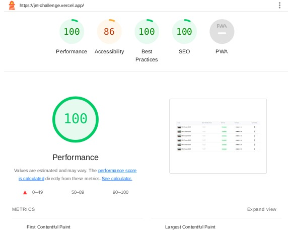

# Jet Challenge

Página web com design responsivo, otimizado para dispositivos móveis. Para acessar, [clique aqui](https://jet-challenge.vercel.app/).

## Começando

### Instalação

Instale as dependências do projeto:

```
npm install
```

## Rodando o Projeto

```
npm run start
```
## Avaliação

* ✔️ Capacidade de resolução de problemas
* ✔️ Organização de código
* ✔️ Criatividade
* ✔️ Responsividade dos componentes
* ✔️ Desempenho da aplicação
* ✔️ Utilização das tecnologias obrigatórias
* ✔️ Nota de avaliação do Lighthouse (Google)


